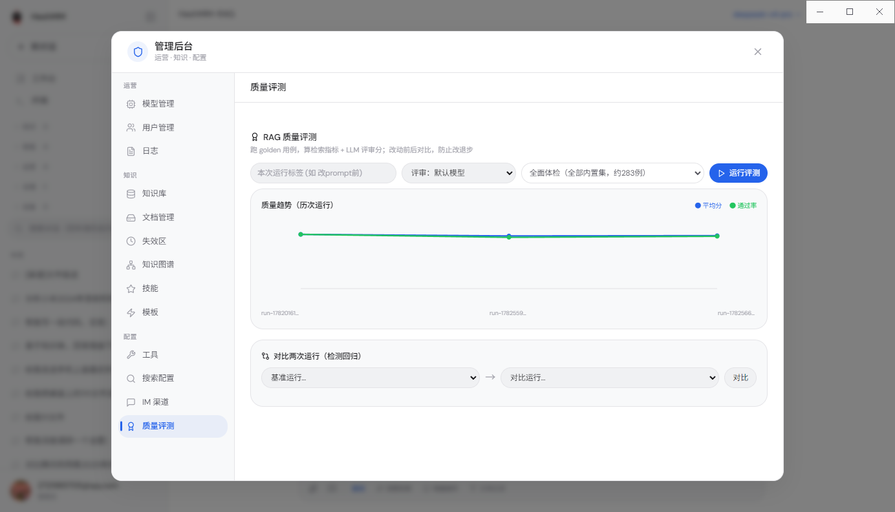
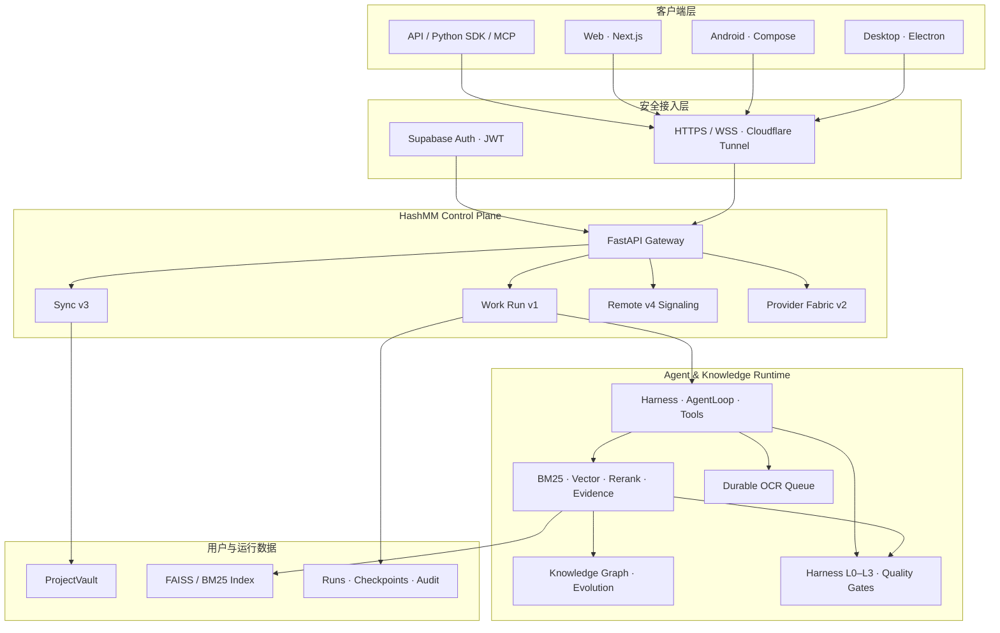
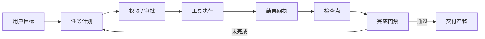

<div align="center">


# HashMM RAG-Agent

**证据驱动、可恢复、跨设备的本地优先 Agent 工作空间**

把私有知识检索、长任务执行、插件与多 Agent、工作画布、自动任务、模型接入和设备接力，收敛到一套可审计的工作流中。

[](client/hashmm/release-manifest.json)
[](client/hashmm/release-manifest.json)
[](client/desktop/package.json)
[-3ddc84)](app/app/build.gradle.kts)
[](client/docs/HASHMM_V2802_REMOTE_TRUST_MEDIA_RECOVERY.md)
[](LICENSE)

[产品概览](#产品概览) · [界面预览](#界面预览) · [核心能力](#核心能力) · [系统架构](#系统架构) · [快速开始](#快速开始) · [服务器部署](#服务器部署) · [开发与验证](#开发与验证)

</div>

> [!IMPORTANT]
> 本仓库保留此前已经公开的 HashMM 历史版本（V2802）源码、原有介绍与资源，供开源学习和 PR 协作。下文版本、功能、截图和验证记录描述该历史版本；当前持续开发的 HashMM 源码保留在私有仓库，不在此公开同步。协作方式见 [COMMUNITY.md](COMMUNITY.md)。请勿提交真实密钥、用户数据、模型、索引、日志和设备凭据。当前文件清理不代表旧 Git 历史已清除。

## 产品概览

HashMM 不是一个只负责回答问题的聊天壳。它面向需要处理私有资料、长期任务和跨设备工作的场景，将 RAG 的“找到可靠证据”和 Agent 的“持续完成任务”组合成一个完整工作空间。

普通问答可以走快速混合检索；复杂任务则进入带审批、工具调用、运行回执、检查点和恢复能力的工作链。桌面端负责本地工作空间与受控原生能力，App 负责移动查看、任务接力和远程入口，服务端提供统一身份、知识检索、Agent Runtime、同步与协议控制面。

### HashMM 的重点不是“再做一个 Chat”

| 产品支柱 | HashMM 的实现 |
|---|---|
| **Evidence-first** | 检索结果、引用来源、新鲜度、证据锚点和评测结果都有结构化记录；模型文字不被当作执行证据。 |
| **Durable Work Kernel** | 会话、任务、审批、工具结果和检查点拥有明确归属；失败和重启后可以恢复，而不是静默丢失任务。 |
| **ProjectVault** | 项目、普通对话、附件、本地工作状态和用户数据有稳定边界，默认保存在用户目录而非程序安装目录。 |
| **Connected Workspace** | 桌面端与 App 使用同一身份和协议事实源；Remote v4 提供设备发现、信任、直连与受控回退。 |
| **Provider Fabric** | 用户可接入有权使用的官方 API、Sub2API、自有 OpenAI/Anthropic 兼容网关或本地模型，并进行健康检查和显式路由。 |
| **Extensible Agent OS** | 插件、技能、多 Agent 角色、自动任务、画布和 Computer Use 共享统一权限、审计和任务状态。 |

## 界面预览

历史桌面、手机与知识图谱截图含个人信息，已撤下。产品介绍与安全素材继续保留。

<p align="center"></p>
<p align="center"><sub>质量评测台：运行金标准用例、观察趋势并比较两次运行的回归</sub></p>

> 界面截图用于展示仓库随附的产品形态；页面细节会持续迭代，版本与协议事实以 [`client/hashmm/release-manifest.json`](client/hashmm/release-manifest.json) 为准。

## 当前版本

| 组件 | 当前版本 | 主要职责 |
|---|---:|---|
| Product / API | `28.0.2` | HashMM V2802 产品与 API 版本 |
| Python Backend | `V2802 / 2.8.2` | FastAPI、RAG、Agent Runtime、同步、Remote Hub |
| Desktop / Installer | `17.0.2` | Electron 工作空间 + Qt 原生安装器 |
| Android App | `12.0.0 (280)` | Kotlin + Jetpack Compose |
| Database Schema | `28` | 多用户、项目、任务与跨端状态 |
| Event Protocol | `hashmm.event.v1` | 流式事件与工具轨迹 |
| Sync Protocol | `hashmm.sync.v3` | 跨端增量同步 |
| Work Protocol | `hashmm.work-run.v1` | 长任务与回执 |
| Remote Protocol | `hashmm.remote.v4` | 设备发现、授权、信任与媒体恢复 |
| Provider Protocol | `hashmm.provider-fabric.v2` | 官方 API、Sub2API 与兼容网关 |

V2802 的主要修复是 Remote v4 媒体启动的可确认交付：桌面端批准后，抓屏启动消息具有 ACK 与重试；Electron 主进程提供不依赖隐藏渲染进程的兼容首帧路径。同一 Supabase 账号通过双端一次性票据认证后自动授权，验证码设备首次配对后建立可撤销信任；关机、重启等危险动作仍需独立确认。

完整说明：[`client/本轮说明-V2802.md`](client/本轮说明-V2802.md) · [`V2802 Remote Trust & Media Recovery`](client/docs/HASHMM_V2802_REMOTE_TRUST_MEDIA_RECOVERY.md)

## 核心能力

### 1. RAG、证据链与知识演化

- BGE-M3 编码、FAISS 向量检索、BM25 关键词检索与融合排序。
- 文档范围、对象属主、可见性和引用边界由服务端再次校验。
- 支持来源、时间、新鲜度、证据锚点、grounding ledger 和可追溯引用。
- OCR 使用持久化队列表达 `queued / running / needs_ocr / failed / completed`，避免把未解析文档伪装成成功。
- 检索运行可以进入评测与知识演化闭环，但写回知识图谱前必须经过证据验证。
- LoHoSearch、长任务与 L0–L3 Harness 用于检验搜索范围、复杂度、工具链和完成门禁。

### 2. Agent Runtime 与可恢复任务链

- Harness 负责上下文装配、权限、预算、沙箱、工具注册和事件输出。
- AgentLoop 负责规划、执行、观察、反思、重试和无进展熔断。
- 任务、运行、工具调用、审批、产物和检查点使用稳定对象 ID，并进行 owner 校验。
- Shell、文件、Git、浏览器与 Computer Use 等敏感能力通过窄接口暴露，默认不因为“工具未知”而推断为只读。
- 跨 Chat 接力使用可验证摘要和任务状态，而不是把另一个会话的全部历史盲目注入。
- 完成门禁同时检查产物存在、格式正确、验证通过和用户目标满足。

### 3. Provider Fabric、Sub2API 与对外 API

- 普通用户可以在设置中的 Provider Fabric 页面添加自己的官方 API、Sub2API 或兼容网关。
- 上游地址必须经过 URL 安全校验；生产环境默认要求 HTTPS，loopback 开发地址除外。
- 上游密钥加密保存，与 HashMM 对外的平台 API Key 分离，并按用户隔离。
- 保存连接后先进行健康检查，再明确选择路由；连接失败不会静默切换到未知上游。
- 支持 `chat_completions`、`responses` 等线协议，具体能力取决于上游声明。
- 对外 API、错误码和 Python 客户端参见 [`PUBLIC_API_V1.md`](client/docs/PUBLIC_API_V1.md)、[`API.md`](client/docs/API.md) 和 [`hashmm_client.py`](client/clients/python/hashmm_client.py)。

> HashMM 只连接用户有权使用的服务。接入第三方网关前，应自行确认服务条款、账户授权和数据处理边界。

### 4. 桌面端与 ProjectVault

- 项目与普通对话保持唯一归属，项目内 Chat 不重复出现在“最近”。
- 拖放文件进入问答栏后先建立附件对象，再进入解析、OCR、索引和引用链路。
- ProjectVault 位于当前用户的稳定数据目录，升级应用不会把用户资料写回安装目录或清空工作空间。
- Electron 主进程负责窗口、更新、远程主机、受控文件与系统能力；preload 只暴露窄方法。
- 管理后台、设置、插件、智能体、自动任务、画布、Provider Fabric 和设备接力使用统一身份与能力快照。
- 正式 Windows 包只通过 `installer-native/` 的 Qt 发布流水线生成。

### 5. Android App 与跨端工作

- “对话、今天、工作、我的”分别承载会话、待办/自动任务、工作运行和个人设置。
- 使用与桌面端一致的 Supabase 身份、后端发现和协议兼容信息。
- 支持用户模型连接、任务与会话同步、设备发现、远程连接和错误诊断。
- 本地缓存减少重复云请求；敏感凭据进入平台安全存储，不写入普通偏好文件。
- 网络离线时区分“可查看缓存”和“需要后端执行”的能力，不把离线数据误报为实时状态。

### 6. 插件、多 Agent、技能与画布

- 插件导入包含路径、大小、文件数、权限声明和 SHA-256 检查；导入不等于自动信任或自动执行。
- Agent 角色库可在交互界面中选择，并通过统一任务内核运行，而不是只作为静态提示词文件存在。
- Skills 使用可审计清单、版本和评测回放控制演化，失败技能不会直接晋升为生产能力。
- Work Canvas 把研究、代码、文档、表格、演示文稿和审阅过程组织成可追踪产物。
- 自动任务与普通 Chat 分离展示，但共享统一任务状态、权限和运行日志。

## 系统架构



### 两条关键闭环




## 快速开始

### 从源码启动开发环境

历史服务器 ZIP 含真实部署配置，已撤下。请使用以下已清理的历史源码，并填写自己的本地配置。


```bash
git clone https://github.com/augety121/HashMM-RAG-Agent.git
cd HashMM-RAG-Agent/client

python -m venv .venv
source .venv/bin/activate
python -m pip install -r requirements.txt

cp .env.example .env
# 只在本机 .env 中填写自己的 Supabase、LLM 与部署配置

./start-hashmm1.sh doctor
./start-hashmm1.sh
```

服务默认端口由 `.env` 决定。开发环境可以监听 loopback；生产公网部署必须使用 HTTPS/WSS、鉴权和可信代理边界。

健康检查：

```bash
curl -fsS http://127.0.0.1:6006/api/health
```

## 服务器部署

### 首次部署

```bash
mkdir -p /root/autodl-tmp
cd /root/autodl-tmp

git clone https://github.com/augety121/HashMM-RAG-Agent.git
cd HashMM-RAG-Agent/client
cp .env.example .env
chmod 600 .env

python -m pip install -r requirements.txt
chmod +x start-hashmm1.sh
./start-hashmm1.sh doctor
./start-hashmm1.sh
```

### 覆盖升级

历史预打包下载已撤下。升级前自行审查并测试源码，在独立目录准备候选；备份并保留现有 `.env`、数据库、模型、索引及 ProjectVault，不能用示例配置覆盖生产配置。

### 生产远程入口

推荐拓扑：

```text
Desktop / App
      │ HTTPS / WSS
      ▼
Cloudflare Tunnel
      │ loopback
      ▼
HashMM 127.0.0.1:6006
```

生产配置至少应满足：

- `HASHMM_REQUIRE_AUTH=1`
- `HASHMM_REQUIRE_SECURE_REMOTE=1`
- `HASHMM_PUBLIC_URL` 使用真实 `https://` 域名
- Uvicorn 只监听受控地址，Cloudflare Tunnel 指向 loopback
- Supabase issuer/project 与桌面端和 App 使用同一身份系统
- CORS 只允许真实产品域名和必要的 loopback 开发地址
- service-role key 只存在于服务器进程环境，不进入客户端、Git、日志或安装包

部署细节、健康检查和验收清单：[`server/README.md`](server/README.md)

## 桌面端与 Android

### Web UI

```powershell
cd client\frontend-next
npm ci
npm test
npm run typecheck
npm run build
```

### Electron Desktop

```powershell
cd client\desktop
npm ci
npm test
python scripts\verify-release.py --source-only
```

正式 Windows 安装器必须通过：

```powershell
$env:HASHMM_NO_PAUSE='1'
..\installer-native\build-all.bat
```

最终 EXE 的实际 SHA-256 必须同时匹配 `.sha256` 和 `.release.json`；SHA-256 只能证明完整性，不能代替 Authenticode 发布者身份。

### Android App

```powershell
cd app
.\gradlew.bat test
.\gradlew.bat assembleDebug
```

正式 APK 需要提供独立 release keystore 环境变量。keystore、alias 和密码禁止提交到仓库。

桌面端 EXE 与 Android APK 后续统一放在 [GitHub Releases](https://github.com/augety121/HashMM-RAG-Agent/releases)，不重复写入源码历史。

## 开发与验证

### 后端

```bash
cd client
python -m pytest -q tests
```

V2802 发布前验证基线：

- Python 后端：`1741 passed, 8 skipped`
- Frontend：`234 tests passed`
- Desktop Node：`80 test files passed`
- Release source gate：通过
- Windows Qt 原生发布：生成并完成三方摘要一致性检查
- Android：定向 JVM 测试与 APK 编译通过

这些数字只描述 V2802 的已执行发布验证，不代表未来提交自动通过。每次发布仍需重新运行与变更面匹配的测试。

### 发布事实源

- 统一版本：[`client/hashmm/release-manifest.json`](client/hashmm/release-manifest.json)
- 当前变更：[`client/CHANGELOG-3-V230-CURRENT.md`](client/CHANGELOG-3-V230-CURRENT.md)
- V2802 说明：[`client/本轮说明-V2802.md`](client/本轮说明-V2802.md)
- API 文档：[`client/docs/API.md`](client/docs/API.md)
- 错误码：[`client/docs/ERROR_CODES.md`](client/docs/ERROR_CODES.md)
- 公开 API：[`client/docs/PUBLIC_API_V1.md`](client/docs/PUBLIC_API_V1.md)

## 仓库结构

```text
HashMM-RAG-Agent/
├── app/                         Android App（Kotlin / Compose）
├── client/
│   ├── hashmm/                  Python 后端、RAG、Agent、Remote、Provider
│   ├── frontend-next/           Next.js Web UI
│   ├── desktop/                 Electron 主进程、preload 与桌面服务
│   ├── installer-native/        Qt 原生 Windows 安装器
│   ├── contracts/               Event / Sync / Work / Remote 协议契约
│   ├── integrations/            Cloudflare Computer 等外部集成
│   ├── plugins/                 受治理插件
│   ├── skills/                  技能与 Skill Packs
│   ├── sql/                     Supabase / 数据库迁移
│   ├── tests/                   后端与集成回归
│   └── docs/                    架构、协议、审计与发布说明
├── docs/                        README 图片素材
├── server/
│   └── README.md               历史源码部署说明（旧预打包下载已撤下）
├── .gitignore                   密钥、用户数据与构建物边界
├── LICENSE
└── README.md
```

## 安全模型

- **身份统一**：桌面端、App 和服务端验证同一 Supabase issuer/project，不能仅凭邮箱字符串认定同一用户。
- **对象隔离**：项目、会话、任务、附件、模型连接和远程设备均执行 owner 校验；必要时未找到与无权访问返回不可枚举结果。
- **权限默认收紧**：未知工具不是只读工具；文件、Shell、Git、浏览器、远程控制和系统动作必须有显式能力声明。
- **插件先验证后信任**：导入、安装、启用和允许运行是不同状态，管理员身份也不能绕过摘要和权限检查。
- **提示注入边界**：网页、附件、命令输出、仓库差异和检索内容都按不可信数据处理。
- **秘密不入库**：`.env`、JWT、API key、service-role key、远程令牌、keystore、设备凭据和真实数据库不会进入仓库。
- **工作树是用户数据边界**：清理前检查 tracked、untracked、ignored 和 detached commit，不能只看一条 `git status` 就删除。

## 已知限制

- 未使用 Authenticode 证书的 Windows 安装器会显示“未知发布者”。
- 未签名或使用调试签名的 Android APK 不能作为正式生产包发布。
- WebRTC 直连受 NAT、运营商、防火墙和系统抓屏权限影响，生产环境仍需 TURN/HTTPS 回退。
- OCR Provider 显示“已安装”不等于已完成真实 canary 验证；生产验收必须上传样本并验证解析结果。
- 仓库随附截图可能早于最新页面细节，不能代替真实构建验收。

## 文档导航

| 主题 | 文档 |
|---|---|
| V2802 远程恢复 | [`HASHMM_V2802_REMOTE_TRUST_MEDIA_RECOVERY.md`](client/docs/HASHMM_V2802_REMOTE_TRUST_MEDIA_RECOVERY.md) |
| V2800 Connected Workbench | [`HASHMM_V2800_CONNECTED_WORKBENCH_RELEASE_SPEC.md`](client/docs/HASHMM_V2800_CONNECTED_WORKBENCH_RELEASE_SPEC.md) |
| Evidence Workbench | [`HASHMM_V2500_EVIDENCE_WORKBENCH_SPEC.md`](client/docs/HASHMM_V2500_EVIDENCE_WORKBENCH_SPEC.md) |
| Agent 兼容与行为内核 | [`HASHMM_V2700_AGENT_COMPATIBILITY_RELEASE_SPEC.md`](client/docs/HASHMM_V2700_AGENT_COMPATIBILITY_RELEASE_SPEC.md) |
| 安全远程与检索 | [`HASHMM_V1200_SECURE_REMOTE_RETRIEVAL_SPEC.md`](client/docs/HASHMM_V1200_SECURE_REMOTE_RETRIEVAL_SPEC.md) |
| Chat Agent | [`CHAT_AGENT_V810_SPEC.md`](client/docs/CHAT_AGENT_V810_SPEC.md) |
| API 平台 | [`API_PLATFORM_V820_SPEC.md`](client/docs/API_PLATFORM_V820_SPEC.md) |
| 管理后台、设置与插件 | [`CONTROL_PLANE_SETTINGS_PLUGINS_V900_SPEC.md`](client/docs/CONTROL_PLANE_SETTINGS_PLUGINS_V900_SPEC.md) |

## License

本仓库继续保留 [`LICENSE`](LICENSE) 中的 MIT 许可声明。私有部署、模型权重、第三方 API、数据集、品牌素材和集成组件可能另有许可或服务条款，使用前应分别核验。
