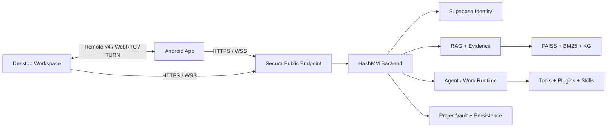

<div align="center">
  
  <h1>HashMM RAG-Agent</h1>
  <p><strong>证据驱动、可恢复、跨设备的本地优先 Agent 工作空间</strong></p>
  <p>Evidence-first · Local-first · Durable · Cross-device</p>

  
  
  
  -3ddc84)
  
</div>

> 本仓库是 HashMM 当前桌面端、Android App、服务端、文档、测试和品牌资源的统一代码快照。安装包不进入 Git 历史，统一通过 GitHub Releases 分发。

## 项目定位

HashMM 不是单一聊天页面。它把 RAG、证据引用、长任务执行、ProjectVault、插件、多 Agent、画布、自动任务和设备接力收敛到同一套可审计工作流中。

核心原则：

- **证据先于结论**：检索、引用、来源新鲜度和任务回执都有结构化记录。
- **状态可以恢复**：会话、项目、任务、审批、OCR 和运行检查点具有明确归属。
- **本地优先**：桌面端保存用户工作空间，服务端负责统一身份、同步、RAG 与 Agent 服务。
- **跨设备一致**：桌面端和 App 使用同一账号、同一事实源和 Remote v4 协议。
- **权限默认收紧**：对象属主校验、工具审批、插件摘要信任和敏感操作确认均在执行链路中生效。

## 当前版本

| 组件 | 版本 | 说明 |
|---|---:|---|
| Product / API | `28.0.2` | HashMM V2802 |
| Python Backend | `2.8.2` | FastAPI、RAG、Agent Runtime、同步与 Remote Hub |
| Desktop / Installer | `17.0.2` | Electron 工作空间 + Qt 原生安装器 |
| Android App | `12.0.0 (280)` | Jetpack Compose |
| Remote Protocol | `hashmm.remote.v4` | 同账号自动授权、设备信任、首帧恢复 |
| Database Schema | `28` | 多用户、项目和工作状态边界 |

统一版本事实源：[`client/hashmm/release-manifest.json`](client/hashmm/release-manifest.json)。

## 核心能力

### RAG 与证据链

- BGE-M3 向量编码、FAISS 与 BM25 混合检索。
- 文档范围、对象属主和引用边界在服务端再次校验。
- 支持来源、时间、新鲜度、内容摘要和证据锚点。
- OCR 队列、失败状态和重试路径可持久化。
- 检索结果可以进入知识演化与评测闭环，但不会把模型文字当作执行证据。

### Agent 工作内核

- ProjectVault 管理项目、会话、附件、任务和本地工作状态。
- AgentLoop、工具审批、任务检查点和运行回执形成可恢复执行链。
- 多 Agent 角色、插件、技能、自动任务和画布共享统一权限边界。
- 长任务支持状态同步、失败终态和跨 Chat 接力摘要。

### 桌面端

- 项目与最近会话、Chat、附件拖放、知识库和检索结果展示。
- 管理后台、设置、插件、智能体、自动任务、画布与设备接力。
- Electron 主进程只通过窄 IPC 暴露文件、终端、Git 和 Computer Use 能力。
- Qt 原生安装器负责正式 Windows 发布，不手工拼装载荷。

### Android App

- 今天、工作、对话和我的四个主要工作面。
- 同账号会话、任务、模型配置和设备状态同步。
- Remote v4 设备发现、配对、远程控制和兼容预览。
- 本地安全缓存降低重复请求；鉴权失效时回到明确登录状态。

### 远程与设备信任

- 同一 Supabase 账号的 Remote v4 双端票据验证通过后自动授权。
- 验证码设备首次校验后建立可撤销信任，后续无需重复输入验证码。
- 主机只保存信任令牌摘要；关机、重启等危险动作仍需独立确认。
- WebRTC 优先，必要时使用 TURN/HTTPS 兼容链路。
- V2802 为媒体启动消息增加 ACK、重试与 Electron 主进程原生首帧兜底。

## 系统结构



更完整的架构与版本说明位于 [`client/docs/`](client/docs/) 和当前发布说明 [`client/本轮说明-V2802.md`](client/本轮说明-V2802.md)。

## 仓库结构

```text
.
├─ app/                         Android App 源码、测试与资源
├─ client/
│  ├─ hashmm/                  Python 后端、RAG 与 Agent Runtime
│  ├─ frontend-next/           Next.js 桌面/网页 UI
│  ├─ desktop/                 Electron 主进程、preload 与本地能力
│  ├─ installer-native/        Qt 原生 Windows 安装器
│  ├─ contracts/               协议与事件契约
│  ├─ integrations/            外部运行时与 Provider 集成
│  ├─ plugins/                 插件包与清单
│  ├─ skills/                  技能包
│  ├─ tests/                   Python 回归测试
│  └─ docs/                    架构、规范与发布文档
├─ docs/                       README 使用的项目图片
├─ server/                     服务器部署与升级入口
├─ .gitignore                  密钥、用户数据和构建产物边界
└─ README.md
```

## 下载与发布

预编译安装包统一放在 [GitHub Releases](https://github.com/augety121/HashMM-RAG-Agent/releases)：

| 产物 | 当前目标版本 | 分发位置 |
|---|---:|---|
| Windows Desktop | `17.0.2` | Release 附件 |
| Android App | `12.0.0 (280)` | Release 附件；正式包必须完成 release 签名 |
| Server Upgrade | `V2802 / 2.8.2` | Release 附件 |

每个正式产物都应同时提供 SHA-256。SHA-256 证明文件完整性，但不能替代 Windows Authenticode 或 Android 发布签名。

## 开发与验证

### 服务端

```bash
cd client
python -m pytest -q tests
```

服务器配置从 `.env.example` 开始创建，真实 `.env`、密钥、数据、模型和索引禁止提交。

### 桌面端与前端

```bash
cd client/frontend-next
npm ci
npm test
npm run typecheck
npm run build

cd ../desktop
npm ci
```

正式 Windows 安装包：

```bat
cd client\installer-native
set HASHMM_NO_PAUSE=1
build-all.bat
```

构建脚本会重新生成 WebUI、Electron 载荷、Qt 安装器、版本资源、SHA-256 和发布清单。

### Android App

```bash
cd app
./gradlew testDebugUnitTest
./gradlew assembleDebug
```

正式 release APK 需要在本机构建环境提供签名参数；keystore 和密码绝不能进入仓库。

## V2802 验证基线

本次代码快照对应的发布验证：

- Python：`1741 passed, 8 skipped`
- Desktop Node：`80` 个测试文件通过
- Frontend：`64` 个测试文件、`234` 项测试通过
- Next.js 生产构建通过
- Windows 原生发布源门禁、打包载荷门禁和 SHA-256 一致性通过
- Server ZIP 升级验证通过，并验证旧数据保留

自动化结果不能替代部署后的真实 Windows ↔ Android、TURN、抓屏权限和长时间稳定性验收。

## 安全边界

仓库不得包含：

- `.env`、service-role key、JWT secret、API Key 和数据库凭据
- Android keystore、PFX、PEM 或签名密码
- ProjectVault、聊天记录、附件、数据库、日志和用户缓存
- 模型权重、向量索引和知识库原始数据
- 安装包、APK、服务器 ZIP、Electron/Python runtime 和依赖缓存

外部网页、上传文件、命令输出和仓库差异都视为不可信输入。插件信任绑定精确摘要；未知工具不能默认视为只读。

## 服务器部署

从 [`server/README.md`](server/README.md) 开始。正式环境必须使用 HTTPS/WSS、Supabase 身份验证和受控代理来源；公网地址不应直接暴露未经认证的 Uvicorn 端口。

## 已知发布限制

- Windows 安装包在没有发布者证书时会显示“未知发布者”。
- Android 未签名 release APK 不能作为正式安装包发布。
- WebRTC 直连受 NAT、运营商和系统权限影响，生产环境仍需要 TURN/HTTPS 兜底。
- OCR Provider 显示“已安装”不等于已完成真实 canary 验证。

## License

当前仓库继续保留 [`LICENSE`](LICENSE) 中的许可声明。若未来调整代码开放范围或商业授权，应单独进行法律与依赖许可证审查。
