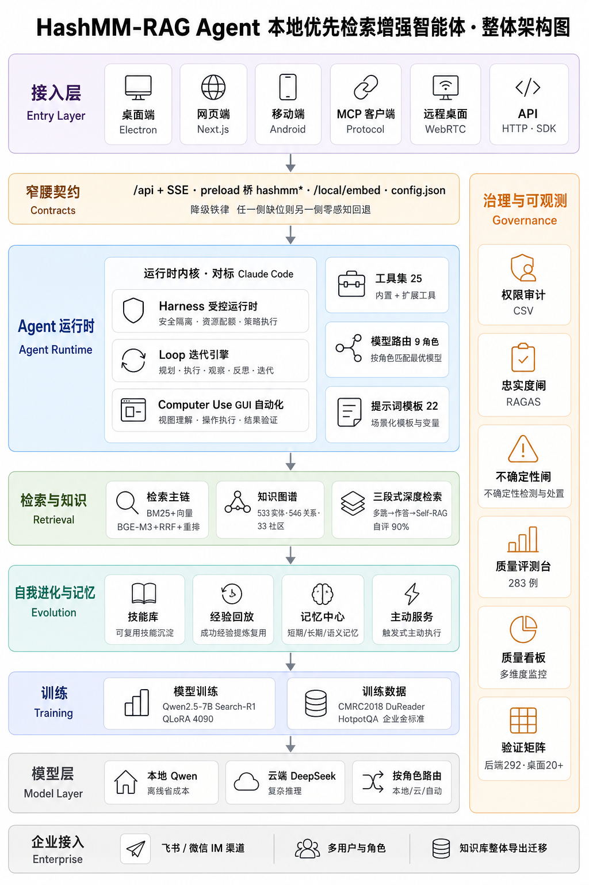

<div align="center">

# 🧠 HashMM-RAG Agent

**本地优先的检索增强智能体 —— 资料不出内网，一张消费级显卡跑通检索、知识图谱、训练与作答。**<br>
**A local-first RAG-Agent — your private documents never leave the network, with retrieval, knowledge graph, training and answering all running on a single consumer GPU.**



<br>

[](LICENSE)
[](#)
[](#)
[](#)
[](#)
[](#)

<br>

> *"私有合同、研报、论文不能上公有云；能本地部署的，又很难在一张显卡上把检索、知识图谱和作答都跑起来。HashMM-RAG Agent 冲着这个缺口做。"*<br>
> *"Private contracts, reports and papers can't go to the public cloud — and the few local options can't run retrieval, a knowledge graph and answering on a single GPU. HashMM-RAG Agent is built for exactly that gap."*

<br>

它不是一个只能问答的演示，而是一套带**智能体运行时、自我进化、主动服务和治理**的本地工作台。检索增强负责从私有文档里找证据，智能体负责自己决定查什么、调哪个工具、要不要在桌面上动手，并对答案做自我纠错。<br>
Not a Q&A demo, but a local workbench with an **agent runtime, self-evolution, proactive service and governance**. Retrieval finds evidence in your private documents; the agent decides what to search, which tool to call, whether to act on the desktop, and self-corrects its answers.

<br>

[亮点 / Highlights](#-亮点--highlights) · [架构 / Architecture](#-架构--architecture) · [深度检索 / Deep Retrieval](#-深度检索--deep-retrieval) · [多端 / Clients](#-多端套件--four-client-suite) · [快速开始 / Quick Start](#-快速开始--quick-start)

</div>

---

## ✨ 亮点 · Highlights

- 🎯 **在你自己的数据上用强化学习训练检索策略 / RL-trained retrieval on your own data** — Search-R1 配方，在一张 RTX 4090 上对 Qwen2.5-7B 做 QLoRA 微调，让模型学会把复杂问题拆成多次检索。<br>Search-R1 recipe, QLoRA fine-tuning of Qwen2.5-7B on a single RTX 4090 — the model learns to decompose hard questions into multiple searches.
- 🔁 **会自我纠错的三段式深度检索 / Self-correcting three-stage deep retrieval** — 自训 7B 多跳检索 → 强模型作答 → Self-RAG 自评证据是否充分，不足则改写子查询自动再检索。自建多跳题答对率 **26.7% → 83.3% → 90.0%**（真机实测）。<br>7B-driven multi-hop retrieval → strong-model answering → Self-RAG self-evaluation with automatic re-retrieval. Multi-hop accuracy **26.7% → 83.3% → 90.0%** (measured).
- 🏠 **本地优先 · 三端窄腰 / Local-first, narrow-waist contracts** — 嵌入、检索、知识图谱、本地语义重排全在内网完成；三端只认几条稳定契约，**任一侧缺位另一侧零感知降级**。<br>Embedding, retrieval, KG and local re-ranking all stay in-network; clients share a few stable contracts and **fall back with zero perception when either side is missing**.
- 🤖 **对标 Claude Code 的三层智能体运行时 / Claude-Code-style three-layer agent runtime** — Harness 受控运行时 → Loop 迭代引擎 → Computer Use GUI 自动化。安全与迭代分离，做成生产级运行时。<br>Harness (controlled runtime) → Loop (iteration engine) → Computer Use (GUI automation). Safety and iteration are separated into a production-grade runtime.
- 🧬 **越用越强 / Gets better with use** — 技能库 + 经验回放，按接地率、置信度和反馈算奖励持续改进，**不重训模型**；记忆中心跨会话记住长期偏好。<br>Skill library + experience replay, improving from grounding/confidence/feedback rewards **without retraining**; a memory center keeps long-term preferences across sessions.
- 🛡️ **治理与可观测 / Governance & observability** — deny-first 权限审计（可导出 CSV）、忠实度闸（RAGAS）、不确定性闸、约 283 条金标准的质量评测台、质量看板。<br>Deny-first permission audit (CSV export), faithfulness gate (RAGAS), uncertainty gate, a ~283-item quality bench, and a quality dashboard.
- 🔌 **企业接入 / Enterprise-ready** — 飞书 / 微信 IM 渠道直接问知识库、多用户与角色（Supabase）、知识库整体导出迁移、标准 MCP 服务。<br>Ask the KB straight from Feishu / WeChat, multi-user roles (Supabase), whole-KB export/migration, and a standard MCP server.

---

## 🗺️ 架构 · Architecture

整体从上到下分七层，右侧是一条贯穿的**治理与可观测**列。桌面端、网页端和 GPU 后端三端只通过几条稳定契约相连，这种**窄腰设计**让每一端都能独立演进和降级；移动端 App 作为第四端，通过云端同步接入。<br>
Seven layers top-to-bottom, with a **governance & observability** column running through the right side. Desktop, web and the GPU backend connect through only a handful of stable contracts — a **narrow-waist** design that lets each side evolve and degrade independently; the mobile app is the fourth client, joining via cloud sync.

| 层 / Layer | 内容 / What's there |
|:---|:---|
| **接入层 / Entry** | 桌面端 Electron · 网页端 Next.js · 移动端 Android · MCP 客户端 · 远程桌面 WebRTC · API (HTTP/SDK) |
| **窄腰契约 / Contracts** | `/api` + SSE · preload 桥 `hashmm.*` · `/local/embed` · `config.json` · **降级铁律**：任一侧缺位另一侧零感知回退 |
| **Agent 运行时 / Runtime** | Harness 受控运行时 · Loop 迭代引擎 · Computer Use GUI 自动化 · 工具集 25 · 模型路由 9 角色 · 提示词模板 22 |
| **检索与知识 / Retrieval** | 检索主链 BM25 + 向量(BGE-M3) + RRF + 重排 · 知识图谱 533 实体/546 关系/33 社区 · 三段式深度检索(自评 90%) |
| **自我进化 / Evolution** | 技能库 · 经验回放 · 记忆中心(短期/长期/语义) · 主动服务 |
| **训练 / Training** | 模型训练 Qwen2.5-7B + Search-R1 + QLoRA(4090) · 训练数据 CMRC2018 / DuReader / HotpotQA / 企业金标准 |
| **模型层 / Model** | 本地 Qwen(离线省成本) · 云端 DeepSeek(复杂推理) · 按角色路由(本地/云/自动) |
| **企业接入 / Enterprise** | 飞书 / 微信 IM 渠道 · 多用户与角色 · 知识库整体导出迁移 |
| **治理 / Governance** | 权限审计(CSV) · 忠实度闸(RAGAS) · 不确定性闸 · 质量评测台(283 例) · 质量看板 · 验证矩阵(后端 292 · 桌面 20+) |

**契约只有几条 / Only a few contracts.** 前后端之间是 `/api` 和 SSE，桌面壳层同源反代、无跨域；桌面原生能力通过 preload 桥以 `hashmm` 命名空间暴露；本地嵌入走 `/local/embed`。一条**降级铁律**贯穿全局——契约任意一侧缺位，另一侧返回 503 / 空对象 / 原样数据，**绝不抛错进主链**。<br>
The front/back boundary is `/api` + SSE with same-origin proxying; native powers are exposed through a preload bridge under the `hashmm` namespace; local embedding goes through `/local/embed`. A **degradation rule** runs throughout — if either side of a contract is missing, the other returns 503 / an empty object / pass-through data and **never throws into the main chain**.

---

## 🔍 深度检索 · Deep Retrieval

普通问答走快路径（混合检索 → 强模型作答，秒级返回）。复杂问题走**三段式深度检索**：自训 7B 驱动多跳检索 → 把带编号的证据交给强模型作答 → Self-RAG 自评证据够不够、答案有没有据，不够就改写子查询自动再检索（最多两轮，仍不足则回「资料不足」而不是硬编）。<br>
Simple questions take the fast path (hybrid retrieval → strong-model answer, sub-second). Hard questions take **three-stage deep retrieval**: 7B-driven multi-hop retrieval → strong model answers over numbered evidence → Self-RAG judges sufficiency and grounding, rewriting sub-queries and re-retrieving when needed (up to two rounds; otherwise it returns "insufficient evidence" rather than hallucinating).

> 三十道自建多跳题，强模型判官。三种配置**检索完全相同**（7B 两跳、捞回 97.7% 支持证据），差别只在谁作答。<br>
> 30 self-built multi-hop questions, strong-model judge. All three configs share **identical retrieval** (7B, ~2 hops, 97.7% supporting-evidence recall); only the answerer differs.

| 配置 / Configuration | 答对率 / Accuracy |
|:---|:---:|
| 7B 自训模型单独作答 / 7B answering alone | 26.7% |
| 强模型基于同样证据作答 / Strong model over the same evidence | 83.3% |
| **+ Self-RAG 自评 + 自动再检索 / + Self-RAG self-eval + re-retrieval** | **90.0%** |

**自适应 / Adaptive.** 同一个模型，多跳题平均跳两次、单跳题平均跳一次。五十道单跳 held-out 题上，多跳版相对单跳版不退化反而更好（65.3% → 68.0%），忠实度 95.6%，几乎不脑补。<br>
The same model hops twice on multi-hop questions and once on single-hop ones. On 50 held-out single-hop questions, the multi-hop checkpoint doesn't regress (65.3% → 68.0%), with 95.6% faithfulness.

> 训练沿用 Search-R1 协议（`think` / `search` / `information` / `answer` 标签，纯结果奖励，检索内容在算损失时屏蔽）。基座 Qwen2.5-7B-Instruct，QLoRA + 4bit，权重压到 5–6GB，只训 LoRA 适配器，单/多跳两版验证集 token 准确率约九成。<br>
> Training follows the Search-R1 protocol (`think`/`search`/`information`/`answer` tags, outcome-only reward, retrieved tokens masked in the loss). Base Qwen2.5-7B-Instruct, QLoRA + 4-bit (~5–6GB), LoRA adapters only; ~90% validation token accuracy.

---

## 🤖 Agent 运行时 · Agent Runtime

智能体运行时按「谁包着谁」分三层，对标 Claude Code 的运行时分层——三层是**包含关系**，不是三个并列模块。<br>
The agent runtime is three nested layers (modeled on Claude Code's runtime layering) — they **contain** one another rather than sitting side by side.

- **Harness · 受控运行时 / controlled runtime** — 工具注册、上下文装配、权限闸、预算闸、连续去重闸串成一条显式有序的守卫链；守卫只读状态做判定，自身出异常也绝不拦执行；预留 hooks 扩展点；整回合用一套 SSE 事件协议对外推送。**160+ 项回归看守。**<br>Tool registration, context assembly, and an explicit ordered guard chain (permission → budget → retrieval-budget → dedup); guards read-only and never block execution on their own failure; hook extension points; one SSE event protocol per turn. **160+ regression guards.**
- **Loop · 迭代引擎 / iteration engine** — 把迭代做成可单测的状态机（开始一轮 / 记录工具调用 / 标记完成或失败，停机原因结构化）；子代理并行、失败隔离、按序归并；**无进展熔断**盯住同一工具同一组参数的连续重复，打转就停。环境隔离守卫只写自己的目录，不动 PATH/系统 Python/全局 npm。<br>A unit-testable state machine; parallel sub-agents with isolation and ordered merge; a **no-progress circuit breaker**; environment-isolation that only writes its own directory.
- **Computer Use · GUI 自动化** — 对标 Anthropic Computer Use：归一化 0–1000 坐标（与分辨率无关）、schema 校验、危险组合键闸（Win+R / Alt+F4 强制确认）、策略闸（只读/高安全模式全部需确认）、每步进回放审计；平台层 Windows 用 user32 SendInput（内联 C#、零原生依赖）、mac 用 osascript、Linux 用 xdotool；还做了 OCR 视觉定位，让模型按文字点按钮而非肉眼估坐标。<br>Anthropic-style Computer Use: resolution-independent 0–1000 coordinates, schema validation, a dangerous-key gate, a policy gate, full replay audit, native execution per platform, and OCR visual grounding.

> 真实运行轨迹：成功率 4/4，平均 1.8 轮、约 15 秒。<br>Real run traces: 4/4 success, ~1.8 rounds, ~15s.

---

## 🖥️📱 多端套件 · Four-Client Suite

桌面、网页、手机加 GPU 后端构成四端跨设备套件，**同账号**，对话历史、记忆和知识库通用。<br>
Desktop, web, mobile and the GPU backend form a four-client suite — **one account**, with shared history, memory and knowledge base.

| 端 / Client | 栈 / Stack | 关键能力 / Highlights |
|:---|:---|:---|
| **桌面 / Desktop** | Electron (~80MB 瘦客户端) | 壳层网关 · 本机 PTY 终端(可拉起 Claude Code / Codex) · 文件/截屏 · 本地 OCR(ONNX) · 独立进程 MCP · C++/Qt6 原生安装器 |
| **网页 / Web** | Next.js | 对话 · 智能体轨迹 · 来源标注 · 文件/产物面板 |
| **移动 / Mobile** | Android (Kotlin · Jetpack Compose) | 助手「小哈」· 离线优先 · **AES-256-GCM** 加密本地缓存(Keystore) · 增量同步 · Realtime |
| **远程桌面 / Remote** | WebRTC | 点对点低延迟(DTLS 加密、实测 <10ms) · MJPEG 回退 · TURN/ICE 兜底 · 双向(被控/反控自己的设备) |

- **跨端接力 / Session relay** — 手机上聊到一半一键交给桌面继续，合盖不中断，反之亦然。<br>Hand a conversation from phone to desktop mid-way (and back).
- **互传文件 / File transfer** — 桌面生成的 Word 推到手机查看/下载；也能在手机上让桌面把电脑里的某个文件发过来。<br>Push desktop-generated docs to the phone, or ask the desktop to send a file from the PC.
- **手机远控电脑 / Phone-controls-PC** — 把桌面画面投到手机并接管键鼠，校园网/公司网穿不透时走中继。<br>Cast the desktop to the phone and take over keyboard/mouse, with a relay mode for restrictive networks.

> 截图位（建议补上真机截图）/ Screenshot slots (drop your real captures here):
> `docs/desktop.png` 桌面主界面 · `docs/mobile.png` 手机对话 · `docs/kg.png` 知识图谱 · `docs/eval.png` 质量评测台

---

## 🛠️ 工具与治理 · Tools & Governance

- **工具集 25 个 / 25 tools** — 文件读写、格式转换、代码沙箱执行、网页与论文读取，以及直接产出 **PPT / Word / Excel / PDF**（`create_document`、`create_pptx_from_plan`、`create_pdf`、`convert_file`…），可逐个启停。
- **提示词模板 22 个 / 22 prompt templates** — 通用、代码、分析、文档、写作、研究、客服、数据、智能体；含**论文精读**、竞品对比、单元测试生成等。
- **模型路由 9 角色 / 9-role routing** — 关键词抽取、查询改写、指代消解、意图分类、标题生成、会话摘要、多查询变体、复杂推理、最终作答，各自可配本地 Qwen / 云端 DeepSeek / 自动。
- **deny-first 权限审计 / deny-first audit** — 默认拒绝、按策略放行，谁调了什么、是否高危、是否成功都可追溯，导出 CSV。
- **质量评测台 / quality bench** — 约 283 条金标准全面体检，画趋势、做两次运行对比，防止改 prompt 或换配置后偷偷退步。
- **知识时效治理 / knowledge freshness** — 给文档设生效/到期日期，过期自动归档、不再进入检索。

---

## 🚀 快速开始 · Quick Start

> 需要 Python 3.10+、Node 18+（网页/桌面），以及一个 OpenAI 兼容的 LLM API key。后端跑嵌入/重排建议有 CUDA 显卡。<br>
> Requires Python 3.10+, Node 18+, and an OpenAI-compatible LLM key. A CUDA GPU is recommended for the backend.

### 后端 / Backend

```bash
git clone https://github.com/YOUR_ORG/hashmm-rag.git
cd hashmm-rag

pip install -r client/requirements.txt
cp .env.example .env          # 填入你自己的 LLM_API_KEY / 可选 HASHMM_SUPABASE_*

cd client
PYTHONPATH=. uvicorn hashmm.api.server:app --host 0.0.0.0 --port 8000
```

打开 `http://localhost:8000` 即是网页端（对话、智能体轨迹、来源标注）。<br>Open `http://localhost:8000` for the web UI.

### 桌面端 / Desktop

```bash
cd client/desktop
npm install
npm start            # 运行 / run
npm run dist         # 打包安装器 / build installers
```

桌面端**本地优先**：可代理远程后端，也可拉起本地后端 sidecar；后端地址与账号在 App 内「设置」里配，**无任何硬编码**。<br>Local-first: proxy a remote backend or spawn a local sidecar; backend URL and account are set in-app — **nothing is hard-coded**.

### 手机端 / Android

在 Android Studio 打开 `app/`，复制 `app/local.properties.example` 为 `local.properties` 填好 SDK 与 Supabase，再 `./gradlew :app:assembleRelease`。

### MCP 服务 / MCP server

```bash
cd client && PYTHONPATH=. python -m hashmm.mcp_server
```

---

## 📦 项目结构 · Project Structure

```
hashmm-rag/
├── client/                 # 后端 + 网页 + 桌面 / Backend + web + desktop
│   ├── hashmm/             #   FastAPI：api/ retrieval/ agent/ memory/ channels/ …
│   ├── frontend-next/      #   Next.js 网页端 / web UI
│   ├── desktop/            #   Electron 桌面端 / desktop client
│   ├── scripts/            #   训练检索策略、建索引、评测流水线 / training, indexing, eval
│   └── sql/                #   Supabase schema / RLS / 同步 SQL
├── app/                    # 安卓 App（Jetpack Compose）/ Android app
├── docs/architecture.png   # 整体架构图 / Architecture diagram
├── .env.example            # 后端配置模板 / backend config template
├── LICENSE                 # MIT
└── README.md
```

---

## 🙏 致谢 · Acknowledgements

建在这些开源研究与工具之上 / Built on open research and tooling：
**Search-R1**（用 RL 训练自主检索）、**Self-RAG**（自我反思的检索-生成-批判）、**RAGAS**（忠实度/上下文相关性评测）、**BGE-M3** 与 **bge-reranker**（BAAI）、**Qwen2.5-7B-Instruct**（阿里巴巴）、**FAISS** 与 **RRF**，以及数据集 **CMRC2018 / DuReader / HotpotQA / 2WikiMultiHopQA / MuSiQue / Natural Questions**。

---

## 📄 License

[MIT](LICENSE) © 2026 HashMM-RAG

<div align="center"><sub>本地优先 · 资料不出内网 · 一张显卡跑通 / Local-first · data stays in-network · runs on one GPU</sub></div>
