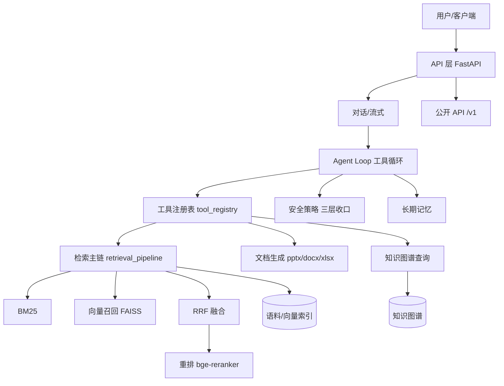

# HashMM-RAG

本地优先的企业级 RAG + GraphRAG + Agentic-RAG 系统。检索增强问答、知识图谱、智能体工具循环，全部可在单卡（RTX 4090）本地运行，数据不出内网。

## 特性概览

检索方面，HashMM 用 BM25 + 向量召回 + RRF 融合 + 重排（bge-reranker）的混合主链，并叠加知识图谱（实体规范化、时序图、自进化提案）与 GraphRAG 能力。智能体方面，提供工具循环（the loop）、上下文压缩、工具治理与权限分层、并行只读工具执行、多专员协作（spawn_worker），对标主流 coding agent harness 的工程结构。文档生成方面，可直接产出 PPTX/DOCX/XLSX/PDF，并内置设计方法论与受控渲染器。

系统大量能力以开关（环境变量 `HASHMM_*`）控制，默认保守关闭，开启零侵入，便于按需启用。

## 快速开始

```bash
# 1. 安装依赖（核心）
pip install -r requirements.txt
# 可选能力（GPU 模型、文档生成、渲染等）见 requirements-optional.txt

# 2. 准备本地模型（BGE-M3 等），放到 .local_models/
# 3. 复制安全配置并先跑诊断；正常启动不会联网安装依赖
cp .env.example .env
chmod 600 .env
./hashmm-start.sh doctor
./hashmm-start.sh

# 4. 跑测试
python -m pytest
```

公网/AutoDL 部署必须在 `.env` 中显式设置 `HASHMM_HOST=0.0.0.0`、
`HASHMM_ENV=production`、`HASHMM_REQUIRE_AUTH=1`、独立随机的
`HASHMM_JWT_SECRET`/`HASHMM_SECRET` 以及精确的 `HASHMM_CORS_ORIGINS`。
启动器会在配置不安全、端口冲突、代码版本错误或依赖不完整时拒绝启动。

Windows 桌面正式包由 `installer-native/build-all.bat` 生成。V337 安装包内置经指纹和
导入验证的 Python 运行时，新电脑无需安装 Python；出包链会同时生成 SHA-256 和版本清单。

## 作为 Python 平台嵌入

项目已提供标准 `pyproject.toml`，可直接安装开发版并调用稳定 `/v1` API：

```bash
pip install -e .
```

```python
from hashmm.client import HashMMClient

client = HashMMClient("http://127.0.0.1:6006", api_key="sk-...")
result = client.rag("这份知识库的核心结论是什么？")
print(result["answer"])
print(result["sources"])
```

服务端需设置 `HASHMM_PUBLIC_API=1` 与 `HASHMM_API_KEY=...`；仅可信内网可用
`HASHMM_PUBLIC_API_OPEN=1` 显式免鉴权。完整契约见 `docs/API.md`。

配置项集中登记在 `hashmm/settings.py`，可运行其 `generate_config_md()` 生成完整配置文档（密钥自动脱敏）。

## 架构



请求进入 API 层后，对话类走 Agent Loop：模型在工具循环中按需调用检索、文档生成、图谱查询等工具，每次工具调用都经过统一的安全策略三层收口（安全工具自动放行 / 沙箱白名单 / 策略审批）。检索工具走混合主链（BM25 + 向量 + RRF + 重排）。

## 模块结构

核心代码在 `hashmm/`，主要分组：检索（retrieval_pipeline、retriever_bridge、query_planner 等，聚合入口 `hashmm.retrieval_group`）、智能体（`hashmm/agent/`：loop、orchestrator、context_manager、tool_governance、parallel_tools 等）、安全（access_control、prompt_safety、security_policy 等，聚合入口 `hashmm.security`）、知识图谱（`hashmm/kg/`）、API（`hashmm/api/`：server、routes、tool_registry、database 等）。前端在 `frontend-next/`（Next.js）。

## 工程化

统一配置层（`hashmm/settings.py`，集中登记开关 + 生成文档）、统一错误码（`hashmm/error_codes.py`，code → HTTP 映射 + 稳定错误体）、请求级 trace 上下文（`hashmm/trace_context.py`）、可观测性（`hashmm/observability.py`，指标 + OTLP 导出）、项目指令文件（`HASHMM.md`，对标 CLAUDE.md/AGENTS.md）。

测试在 `tests/`，运行 `python -m pytest`。测试用临时 DB 隔离，不触碰真实数据。

## 对外 API

启用 `HASHMM_PUBLIC_API=1` 后开放 `/v1` 端点（info / search / rag）。详见 `docs/API.md`。

## 许可

详见仓库 LICENSE。设计能力部分参考了 huashu-design（MIT）。
