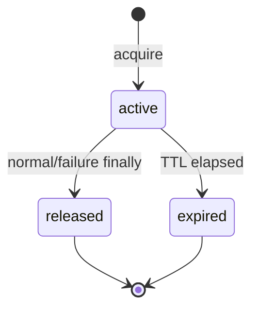

# HashMM V820 API Platform 大版本规格

状态：实施基线（Implementation Baseline）  
版本：V820 / Protocol `2026-08-08.v2`  
制定日期：2026-08-08  
证据来源：HashMM V810 源码、`sub2api-main (1).zip` 源码、用户提供的面试实战资料。本文不把参考项目能力写成 HashMM 已实现能力。

## 1. 版本结论

V820 的目标不是继续增加路由数量，而是把 V810 已有的 Responses、Threads、Runs、Checkpoint、Approval、Usage 串成可运营、可审计、可撤销的 API 平台。

本版本必须形成以下闭环：

完成标准不是“页面存在”或“接口返回 200”，而是同一密钥从创建、调用、受限、计量到撤销均有确定性测试证据。

## 2. 参考审计与真实差距

### 2.1 从 sub2api 源码确认的工程标准

本地参考源码确认其 API 平台覆盖：API Key 生命周期、用户/分组/模型策略、IP 黑白名单、余额与时间窗限额、请求和 Token 速率限制、用户与账号并发、用量日志、幂等、订阅与价格、账号调度、管理监控和审计。

V810 已有 Responses/Threads/Run 控制、幂等、用量流水及预算预占，但公网鉴权主要仍是单个环境变量密钥，不能满足多用户生产平台的最小控制要求。

| 能力 | V810 现状 | V820 验收目标 |
|---|---|---|
| API Key | 单环境变量密钥 | 每用户多 Key；原文只展示一次；前缀可识别；即时撤销 |
| 权限 | 只有“是否授权” | Scope、模型、项目、IP、过期时间五层约束 |
| 限流 | 无 Key 级原子 RPM | SQLite 事务内固定窗口计数；明确 `Retry-After` |
| 并发 | 无 Key 级租约 | 有 TTL 的并发租约；异常退出可自动回收 |
| 配额 | 主要按 owner 预算 | Key 级配额原子预占/结算；失败释放；不可超卖 |
| 用量归属 | owner/provider/model | 增加 `access_key_id`，支持每 Key 汇总 |
| 运维 | 无自助控制台 | 创建、复制一次、编辑策略、查看用量、撤销 |
| 兼容 | `/v1` 已存在 | 旧环境变量 Key 保持兼容并标记 legacy |

### 2.2 面试实战资料转化为工程约束

资料中关于 Agent 状态、工具调用、RAG 评估、失败恢复、后端工程和项目表达的内容，在 V820 落为以下硬约束：

1. 状态不能只在内存：限流窗口、并发租约、配额预占和撤销状态必须持久化。
2. 失败必须可恢复：租约和预占均有 TTL；重复结算必须幂等。
3. 工具与模型不是同一权限：Scope 决定动作，模型/项目 allowlist 决定资源边界。
4. 评估不能只看最终回答：测试需覆盖并发竞态、失败释放、越权、撤销传播和用量守恒。
5. 项目亮点必须有证据：HashMM 的差异化是“证据型 RAG-Agent + 可恢复 AgentLoop + 可审计 API 访问平面”，不是未经验证的模型能力口号。

## 3. 范围

### 3.1 V820 必须交付

- 持久化 API Key 数据模型及加法迁移。
- 管理接口：创建、列表、详情、更新、撤销、Key 级用量。
- 公网 `/v1` 接口统一鉴权上下文。
- Scope、允许模型、允许项目、IP、过期时间校验。
- Key 级 RPM、并发租约、配额预占和结算。
- Usage 事件绑定 Key，支持 Key 维度聚合。
- 前端“API 访问”设置页；密钥只展示一次且不可恢复。
- 旧 `HASHMM_API_KEY` 的兼容路径。
- 后端/前端安全和状态机回归测试。
- 文档、版本、发布门禁同步。

### 3.2 明确不虚构为 V820 已完成

- Stripe、Cloudflare Wallet/x402 等真实资金收付。它们需要外部账户、签名密钥、对账和退款制度，不能用本地余额字段冒充支付系统。
- sub2api 式多供应商账号池、账号粘性调度和上游账号自动封禁。HashMM 当前模型管理器与此类代理池不是同一产品边界。
- Redis 跨节点全局限流。V820 的 SQLite 事务方案对单实例/共享数据库有效；多活部署需 Redis 或具有线性一致性的外部协调器。
- 明文 API Key 恢复。安全设计明确禁止恢复，只能轮换。

上述项目进入 V830+ 路线，不计入 V820 完成率。

## 4. 领域模型

### 4.1 `api_access_keys`

| 字段 | 约束 |
|---|---|
| `id` | 不可预测 UUID，主键 |
| `owner_id` | 必填；所有管理查询必须 owner-check |
| `name` | 1–80 字符，同一 owner 下用于识别 |
| `key_prefix` | 可展示前缀，不足以还原密钥 |
| `secret_hash` | 完整密钥 SHA-256；数据库绝不保存原文 |
| `status` | `active` / `disabled` / `revoked` |
| `scopes_json` | Scope 数组；默认最小权限，不默认 `*` |
| `allowed_models_json` | 空数组表示不额外限制，否则精确 allowlist |
| `allowed_projects_json` | 同上 |
| `ip_allowlist_json` | CIDR/IP；非空时来源必须命中 |
| `ip_denylist_json` | CIDR/IP；deny 优先 |
| `quota_limit` | 可空；非负计量单位上限 |
| `quota_used` | 已结算用量，非负 |
| `rpm_limit` | 可空；正整数 |
| `concurrent_limit` | 可空；正整数 |
| `expires_at` | 可空 Unix 秒 |
| `last_used_at` | 成功通过鉴权后更新 |
| `revision` | 乐观并发控制；更新时必须匹配 |
| `created_at/updated_at/revoked_at` | 审计时间 |

密钥格式：`hmm_v2_<urlsafe-random>`。随机部分至少 256 bit。创建接口仅在成功响应中返回一次 `secret`；列表、详情、日志、错误和数据库均不得出现完整值。

### 4.2 状态辅助表

- `api_key_rate_windows(key_id, window_start, request_count)`：固定一分钟窗口，主键为 Key + 窗口。
- `api_key_leases(id, key_id, request_id, expires_at, released_at)`：并发许可；计数前清理过期未释放租约。
- `api_key_quota_reservations(id, key_id, idempotency_key, amount, state, expires_at, settled_amount)`：`reserved → settled|released|expired`。
- `usage_events.access_key_id`：加法列，可空以兼容 V810 历史数据和 legacy Key。

## 5. 权限模型

标准 Scope：

- `models:read`
- `responses:read`, `responses:write`
- `threads:read`, `threads:write`
- `runs:read`, `runs:write`
- `usage:read`
- `*`：仅显式选择时拥有全部当前 Scope；不隐式扩展管理端权限。

管理接口只能使用 Supabase 会话身份，API Key 不能管理或生成新的 API Key，避免密钥自我扩权。

校验顺序固定为：

1. 提取 Bearer 或 `x-api-key`，拒绝 Query String 密钥。
2. 匹配 managed key；不匹配时才检查 legacy 环境变量 Key。
3. 检查状态、过期、来源 IP。
4. 检查路由 Scope。
5. 解析请求后检查模型和项目 allowlist。
6. 原子消费 RPM。
7. 获取并发租约与配额预占。
8. 执行；最终块中完成结算和租约释放。

未知/已撤销/不属于调用者的对象尽量返回相同的不可枚举错误。错误响应不泄露 key ID、owner、剩余额度之外的内部策略。

## 6. API 契约

### 6.1 管理面

| 方法 | 路径 | 语义 |
|---|---|---|
| `GET` | `/api/platform/keys` | 仅列出当前用户 Key |
| `POST` | `/api/platform/keys` | 创建；仅本响应包含 `secret` |
| `GET` | `/api/platform/keys/{id}` | owner-check 详情 |
| `PATCH` | `/api/platform/keys/{id}` | 带 `revision` 更新策略 |
| `DELETE` | `/api/platform/keys/{id}` | 幂等撤销，不物理删除审计记录 |
| `GET` | `/api/platform/keys/{id}/usage` | owner-check 的 Key 用量汇总 |

`PATCH` 不允许修改 `owner_id`、`secret_hash`、`quota_used`。轮换通过创建新 Key、迁移调用方、撤销旧 Key 完成。

### 6.2 调用面错误

| HTTP | `error.code` | 场景 |
|---|---|---|
| 401 | `invalid_api_key` | 缺失、未知、撤销、禁用或过期 |
| 403 | `insufficient_scope` | 缺少路由 Scope |
| 403 | `resource_not_allowed` | 模型、项目或 IP 不允许 |
| 409 | `revision_conflict` | 管理更新版本冲突 |
| 429 | `rate_limit_exceeded` | RPM 超限，返回 `Retry-After` |
| 429 | `concurrency_limit_exceeded` | 并发租约已满 |
| 429 | `quota_exceeded` | 预占后将超过 Key 配额 |

所有错误沿用统一 JSON envelope，并携带请求 ID。限流响应返回 `X-RateLimit-Limit`、`X-RateLimit-Remaining` 和 `Retry-After`。

## 7. 原子性与恢复语义

### 7.1 RPM

在 `BEGIN IMMEDIATE` 事务内创建或递增当前分钟窗口。只有计数未达上限才提交消费。并发请求不得同时越过上限。

### 7.2 并发租约

服务器崩溃后不依赖内存释放；下一次获取会回收过期租约。流式响应的租约直到流结束或断开后的清理块才释放。

### 7.3 配额

可用额度计算为：`quota_limit - quota_used - active_reserved`。预占、结算、释放都在事务中完成。同一 `idempotency_key` 重试返回原记录，不重复扣减。结算量低于预占量时释放差额；高于预占量时只能在剩余额度允许时补扣，否则记录受控的超额状态并告警，不能静默丢失用量。

### 7.4 撤销

撤销事务提交后，新请求立即失败。已进入执行阶段的请求不强制杀死，但最终结算仍必须写入原 Key；这样既不破坏执行中的资源，也不让撤销规避计费。

## 8. 前端规格

“设置 → API 访问”提供：

- Key 卡片：名称、前缀、状态、Scope、模型/项目约束、RPM、并发、配额、过期、最后使用。
- 创建表单：默认最小 Scope；高级策略折叠展示。
- 创建成功页：完整密钥只出现一次，提供复制；关闭前明确提醒无法再次查看。
- 编辑：只修改策略，提交 `revision`；冲突时刷新而非覆盖。
- 撤销：二次确认；撤销后 UI 立即更新且不可恢复。
- 用量：当前 Key 请求/Token/估算费用等服务端实际可用指标；不伪造供应商账单。

密钥不得写入 localStorage、日志、埋点或 URL。组件卸载时清除内存中的一次性 secret。

## 9. 迁移与兼容

- 所有数据库变化为 `CREATE TABLE IF NOT EXISTS` / `ALTER TABLE ADD COLUMN` 型加法迁移。
- V810 历史 `usage_events.access_key_id` 为 `NULL`，仍可参与 owner 汇总。
- `HASHMM_API_KEY` 保留；其调用标记为 `legacy`，没有 Key 级策略与管理记录，文档建议迁移。
- `HASHMM_PUBLIC_API_OPEN=1` 仅用于明确启用的开发环境；安全启动检查继续对公网开放配置报警或阻止。
- 不改变现有 Python 依赖和服务器 pip 环境。

## 10. 验收矩阵

### 10.1 后端确定性测试

- 创建响应含 secret，数据库/列表/详情不含 secret。
- 用户 A 不能读、改、撤销用户 B 的 Key，且不可通过响应区分“不存在/无权”。
- 撤销、禁用、过期 Key 均被拒绝；旧环境变量 Key 仍兼容。
- deny IP 优先于 allow；不信任未经配置的 `X-Forwarded-For`。
- 每个路由 Scope、模型 allowlist、项目 allowlist 有正反用例。
- 多线程并发冲击 RPM、并发和配额，提交成功数不超过限制。
- 异常执行、客户端中断、TTL 到期均可释放或回收租约/预占。
- 同一幂等键重复预占/结算不重复扣费。
- Usage 能按 owner 和 Key 汇总，历史 NULL Key 数据不丢失。
- Chat Completions 与 Responses 都走原子完成路径，不产生 completed 响应却缺终态事件的裂缝。

### 10.2 前端测试

- 创建后只在一次性视图显示 secret。
- 列表/刷新不再出现 secret。
- 编辑发送 revision；409 显示冲突并刷新。
- 撤销有确认，成功后不可再复制或启用。
- 网络失败不把界面误标为成功。

### 10.3 发布门禁

- `python -m pytest -q tests`
- `frontend-next`: `npm test`, `npm run typecheck`, `npm run build`
- Desktop 对应 Node 测试。
- `desktop/scripts/verify-release.py --source-only`
- `HASHMM_NO_PAUSE=1 installer-native/build-all.bat`
- EXE SHA-256 必须与 `.sha256` 和 `.release.json` 一致；签名状态单独如实报告。

## 11. 后续路线（不计入 V820）

- V830：Redis/数据库协调器、多实例全局限流、实时策略失效广播。
- V840：供应商账号池、健康检查、熔断、粘性会话与成本路由。
- V850：订阅计划、支付适配器、账单对账、退款和 Cloudflare Wallet/x402 受控实验。
- V860：把 LoHoSearch、Agentic RAG 和知识演化评测接入发布质量门禁；模型提升必须由可复现实验而不是单次演示证明。

