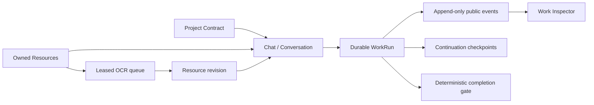

# HashMM V810 Chat Agent 连续性与资源处理规范

状态：已实现并进入发布验证。本文描述 V810 的产品契约、确定性边界和验收标准；代码、测试输出和发布摘要才是完成证据。

## 1. 目标与非目标

V810 把项目目标、Chat、附件、OCR、审批、公开任务链、检查点、用量与验收串成一个 owner-scoped 工作闭环。用户切换 Chat、关闭桌面端或服务重启后，可从持久化事实恢复任务；模型文字不能单独把任务标为完成。

V810 不保存、展示或“蒸馏”模型隐藏思维链。可持久化的只有用户目标、计划、工具调用事实、审批、来源、检查点、失败原因、成果和验收状态。

## 2. 核心事实源

- Project 不是第二套 Chat。Project 只冻结目标、交付物、成功标准、项目提示和资源成员关系。
- Chat 是用户工作主线。消息、附件和对话提示均按 owner 持久化。
- WorkRun 是执行事实源。右侧任务面板只投影持久事件和检查点。
- Resource 以 SHA-256 内容寻址；相同显示名但不同字节不能静默覆盖。

## 3. 协议契约

### 3.1 `hashmm.project-contract.v1`

创建 WorkRun 时冻结项目 revision、goal、deliverable、custom_prompt、success_criteria 和 permission_mode。项目成功标准合并进入 run task contract，并标记 `source=project`。运行中修改项目只影响后续新 run，不篡改已准入任务。

### 3.2 `hashmm.chat-continuation.v2`

准入、计划变化、步骤完成、steer、等待审批/输入、中断和终态都保存检查点。检查点包含 generation、continuation cursor、公开计划、剩余步骤、重试策略和可验证状态，不包含供应商 reasoning 字段。

### 3.3 `hashmm.resource.v2`

资源摘要必须报告 `resource_id`、`resource_revision`、SHA-256、检测类型、解析状态、页数、可读页、已核算页、失败页、空白页、解析器和警告。`ready`、`partial`、`needs_ocr`、`encrypted`、`corrupted`、`unsupported` 与 `missing` 是不同状态，不允许用空文本冒充 ready。

### 3.4 `hashmm.ocr-job.v2`

OCR 作业按 owner 隔离，支持优先级、租约、心跳、过期回收、退避重试和取消。作业执行前重新计算源文件 SHA-256；字节改变时以 `source_changed` 失败。成功后原子更新资源 revision，并投影到所有已关联 Chat，公开响应不暴露服务器 `source_path` 或 `result_path`。

## 4. OCR 引擎策略

- 默认引擎为 PaddleOCR；`chi_sim+eng` 映射到 PaddleOCR 的 `ch` 模型。
- 安装检测只返回 `installed_unverified`。只有 `GET /api/ocr-jobs/capabilities?probe=true` 真正执行本地图像推理并得到非空结果，才可报告 ready。
- 扫描 PDF 默认按 300 DPI 逐页渲染，保存 `p.N` 锚点、页级进度、失败页和空白页。部分页失败时结果为 `partial`，不是伪装的 ready。
- Tesseract 是显式可选引擎，不再作为默认回退制造不确定结果。
- Unlimited OCR 只能作为隔离 sidecar 使用，默认关闭。主进程发送受大小限制的文件字节与 SHA-256，不发送宿主机路径；远程 sidecar 需显式允许。
- 正常启动和请求路径禁止执行 pip。现有服务器包集合保持不变；服务器已经安装的 PaddleOCR/PaddlePaddle 由能力探针验证。

## 5. API

- `GET /api/ocr-jobs?conversation_id=...`：当前 owner 的 OCR feed。
- `GET /api/ocr-jobs/capabilities?probe=true|false`：安装事实与可选真实 canary。
- `GET /api/ocr-jobs/{id}`、`POST .../{id}/retry`、`POST .../{id}/cancel`：owner-scoped 作业控制。
- `GET /api/resources/{resource_id}`：资源权威摘要。
- `POST /api/resources/{resource_id}/ocr-jobs`：显式创建新的 OCR 尝试。
- `GET/POST/DELETE /api/projects/{project_id}/resources`：项目资源成员关系；会话与项目必须属于同一 owner。
- `/v1/responses` 的 completed 状态与 `response.completed` 事件在同一 SQLite 事务提交，终态不再领先于可重放事件。

所有对象 ID 必须先做 owner 校验。不存在和无权访问统一返回不可枚举的 not-found 语义。写 API 延续 `/v1` 幂等键、用量预留/结算与预算失败关闭规则。

## 6. ProjectVault 与最近记录

- 默认 ProjectVault 为用户选择的 HashMM 安装目录下 `HashMM Data`，不写死 C 盘；用户可显式选择其他非系统目录。
- 首次迁移从旧数据目录复制，逐文件校验 SHA-256 后原子启用；旧目录保留，重复启动不覆盖新 Vault。
- “最近”以 owner-scoped 服务端会话分页为权威源，项目会话同时参与时间线；本地缓存只做离线投影，不得用固定 40/100 条截断替代服务端事实。

## 7. 参考方案的落地边界

| 参考方向 | V810 采用的工程原则 | 本轮不冒充的能力 |
|---|---|---|
| sub2api / OpenAI-compatible API | `/v1` 资源化对象、幂等写、持久 SSE、模型与能力发现、用量账本和预算预留 | 未经真实上游验收的供应商兼容性 |
| CoEvoKG | 搜索证据先进入 owner/project 隔离候选区，经 provenance、冲突、人工审查和评测门再晋升不可变 KG 版本 | 自动把搜索结果直接写入生产知识图谱 |
| LoHoSearch | L0–L3 harness、固定快照、SHA-256、工具步数和失败终态 | 未提供官方 544 题快照时的“官方成绩” |
| Agent wallet / x402 | owner 预算、预留、结算、幂等账本和权限护栏作为支付前置控制面 | 未接入真实钱包、结算账户或 x402 网关时的真实支付 |
| 隔离 Agent runtime | 工具权限、工作区边界、租约、检查点和 sidecar 隔离 | 未部署容器/isolates 控制面时的云端沙箱 |
| Billable Usage / FOCUS | 用量事件记录 provider/service/model/quantity/unit/currency/price version | 未导入真实账单时的会计级成本 |

## 8. 验收门

1. 同一文件只上传一次，保存字节的 SHA-256 与资源摘要一致。
2. 关闭内联 OCR 后，扫描 PDF 必须进入持久队列；服务重启可回收过期租约。
3. waiting approval/input、steer、中断与完成均存在 continuation checkpoint。
4. 项目验收项没有真实 check 时，完成门保持未通过。
5. 任意跨 owner 访问 Project、Conversation、Resource、OCR Job、Run 均失败关闭。
6. 前后端状态只消费持久事实；模型自述、HTTP 200 或“依赖已安装”都不是执行成功证据。
7. 发布必须通过后端全量测试、前端测试/typecheck/build、桌面定向测试、source gate、原生安装器流水线和三方 SHA-256 一致性检查。

## 9. 环境验收边界

PaddleOCR GPU 精度、Unlimited OCR sidecar、LoHoSearch 官方 full 数据、真实第三方支付、HTTPS/WSS、TURN、24 小时公网稳定性和 Authenticode 发布者身份都依赖部署环境。缺少相应证据时，产品必须显示 unavailable、unverified 或未验收，不能写成已完成。
