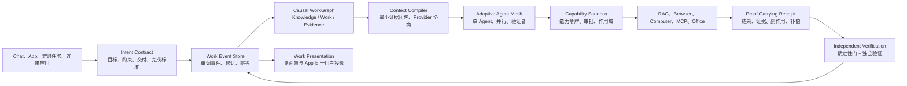

# HashMM V401–V410 深化路线

状态：V410 已完成本轮可确定性验证的核心实现；长期运行指标仍需真实环境验收  
基线：V400  
产品定位：证据原生、跨设备连续、可验证交付的工作智能体

## 0. V410 落地状态

本文件最初是执行路线。V410 已把其中能够在当前代码库中确定性完成的主干落到生产链：

- 身份与启动：AutoDL 对外监听、旧配置安全迁移、登录前后端会话校验和 401/403 单一权威。
- 唯一工作写模型：事件、快照、账户游标、generation 和当前代次原子提交。
- Graph Engineering：Knowledge / Work / Evidence 三平面 generation 与内容寻址 Artifact 修订链。
- 多 Agent：基于并行收益、协调成本、共享写风险和依赖风险的确定性 `auto` Mesh 决策。
- 跨端接力：App 使用账户隔离加密 outbox、稳定命令 ID、有界退避和幂等核对。
- 浏览器、画布与 Office：真实输出或证据按实际 SHA-256 注册，不以模型文字或页面状态冒充完成。

仍未完成的长期门包括 24 小时身份浸泡、真实 AutoDL 公网验收、多设备弱网混沌、全面 OS 级沙箱迁移，以及固定数据集上的 DOM 扰动、100 轮长对话和多 Agent 成本收益指标。它们继续作为发布后的工程路线，不能被描述为 V410 已证明结果。

## 1. 结论

V400 已经把 Chat、长任务、多 Agent、浏览器、电脑操作、画布、文档成果和验收投影到统一工作画布。下一阶段不再增加孤立能力页，而是把现有协议深化为唯一运行内核，并把技术复杂度从普通用户界面中移走。

用户只需要理解五个对象：

1. 我想完成什么；
2. HashMM 正在做什么；
3. 现在需要我处理什么；
4. 结果和依据是什么；
5. 完成后如何继续、修改或撤回。

`Context Capsule`、`Causal WorkGraph`、`Agent Mesh`、`MCP`、`Hook`、`Sandbox`、`Receipt` 和模型路由属于内部实现或高级详情，不再成为普通用户开始工作的前置知识。

## 2. 当前可证明的基线与真实差距

| 领域 | 当前可证明能力 | 下一阶段缺口 |
| --- | --- | --- |
| 工作对象 | `hashmm.work-canvas.v1` 已统一概览、过程、依据、成果和验收 | Chat、Team、Loop、Dispatch 仍有各自状态写入入口，需要事件溯源式单写模型 |
| 长对话 | 已有上下文胶囊、压缩、检查点和恢复元数据 | 尚未形成可逐调用复现的内容寻址证据闭包和跨 Provider 等价性门 |
| Graph Engineering | 已有因果图、证据图、选择性失效 | Knowledge / Work / Evidence 三平面尚未完成原子 generation 切换与跨工作失效调度 |
| 工具执行 | 已有权限、执行回执、完成门和部分幂等 | 有副作用工具的补偿目录、撤销演练和全链一致覆盖尚不完整 |
| 多 Agent | 已有持久 Mesh、邮箱、独立验证和协作停止 | 拓扑仍主要由模式选择，尚未通过收益、成本、冲突和风险数据自适应选择 |
| 浏览器与画布 | 已有 EvidenceRef、来源回跳、哈希复核、画布块关联 | DOM 扰动重定位基准、自动重验队列和成果块级影响传播仍需系统化 |
| 跨端 | 桌面端和 App 已消费同一 WorkRuntime/WorkCanvas | 仍需统一离线命令、事件乱序收敛、设备级身份和跨端混沌测试 |
| 用户体验 | 已有“工作”投影和四层详情 | 普通界面仍保留较多能力入口和开发者页面，需要按任务阶段渐进展示 |

## 3. 唯一运行内核

后续所有入口必须汇入 `WorkKernel`，不能再让页面直接调用某个孤立模块并自行解释结果。

### 不可妥协的内核规则

- 一个用户动作只能对应一个 owner-bound、revision-bound、idempotency-bound 命令。
- 模型文字、页面显示和进度动画都不能成为完成证据。
- 原始网页、上传文件、工具输出和外部应用内容始终是不可信数据。
- 权限判断发生在执行前；执行后必须有收据；有副作用动作必须说明影响范围和可否补偿。
- 客户端只能投影服务端事实，不能自行把未知状态推断为成功。
- 跨端使用同一事件序列和冲突规则，不以“最后写入覆盖全部”解决冲突。

## 4. V401–V410 执行计划

### V401：身份与会话连续性

本轮已完成第一部分：修复主动刷新后仍发送旧 access token、启动双刷新、旧 refresh token 跨账号继承、旧在途刷新覆盖新登录。

后续完成：

- Electron 主进程增加桌面身份协调器，所有主窗口、工作窗口和右栏宿主只消费主进程发布的短期 access token；
- refresh token 不再复制给多个渲染进程；
- 每台桌面端和 App 使用独立设备会话，支持单设备撤销而不是全账号被动掉线；
- 增加 `authenticated / refreshing / offline-valid / reauth-required` 明确状态，网络故障不伪装成登录失效；
- 对 401、离线、令牌轮换、切换账号、休眠恢复和系统时间变化做状态机测试。

验收：

- 登录后连续运行 24 小时不出现无原因登录弹层；
- 100 次并发请求只发生一次刷新；
- 新账号登录不会被旧刷新结果覆盖；
- 后端离线时保留本地有效会话和缓存；
- 真正撤销的凭据只弹一次登录提示，并保留未发送草稿。

### V402：原子 Work Event Store 与三平面图

- 以 append-only `WorkEvent` 作为工作状态唯一写入入口；
- Team、Loop、Dispatch、Browser、Computer、Artifact 不再直接维护互相冲突的终态；
- Knowledge、Work、Evidence 三个逻辑平面共用 generation manifest；
- 新 generation 完整构建、校验后原子切换，失败时继续读取上一代；
- 来源变化进入重验队列，只失效依赖闭包；
- 桌面端和 App 使用事件序号、服务器修订和幂等命令收敛。

主要落点：

- `hashmm/agent/work_runtime.py`
- `hashmm/agent/causal_work_graph.py`
- `hashmm/agent/task_evidence_graph.py`
- `hashmm/api/routes/work_runtime.py`
- `frontend-next/components/desktop/WorkCanvasView.tsx`

验收：

- 崩溃发生在 generation 写入中途时，客户端看不到半成品；
- 重放同一事件得到相同工作投影；
- 重复、乱序和迟到事件不能回写终态；
- 来源变化不影响无因果关系的成果。

### V403：可复现 Context Capsule 与长对话

- 每次模型调用生成独立 Capsule manifest；
- 固定保留目标、约束、未完成验收条件、用户决策、阻塞和权限，不因压缩被删；
- 大型网页、文件和工具输出移到内容寻址对象库，胶囊只保存 owner-bound 引用与哈希；
- 增加 Provider Capability Contract，显式记录上下文窗、工具调用、视觉、结构化输出、缓存和流式能力；
- 模型切换前做能力差异检查，不满足任务要求时降级必须向用户说明；
- 建立“压缩前后约束保持率”和“每千 Token 验收通过率”评测。

验收：

- 100 轮长对话压缩后，所有 required 约束仍可恢复；
- 从检查点继续时能说明本轮模型实际看到了哪一版胶囊；
- 切换 Provider 不会静默丢失工具、视觉或结构化输出要求；
- 原始证据仍可追溯，但不会被无界塞回上下文。

### V404：携证操作、补偿目录与 OS 级沙箱

- 为所有 Browser、Computer、Shell、文件、MCP、Office 工具建立统一副作用分类；
- 每个敏感工具声明 `read_only / reversible / compensatable / irreversible`；
- 执行前计算作用域、敏感度、外部影响和可逆性；
- 执行后回执保存输入/结果哈希、真实变更、验证、补偿动作和幂等键；
- Windows 本地执行迁移到受控 worker/Windows Sandbox 或等价 OS 边界，不能把字符串扫描当隔离；
- 沙箱不可用时默认失败关闭；普通 Chat 不得静默退回宿主全权限。

验收：

- 1000 次重复投递不产生重复外部副作用；
- 每个有副作用工具都有补偿覆盖或明确“不可撤销”声明；
- 未授权路径、域名、应用和账号均被技术边界拦截；
- 子 Agent 继承父任务的最小权限，不能自行扩大。

### V405：Adaptive Agent Mesh

- 先预测单 Agent、子 Agent、并行团队、流水线、执行者+验证者的效用；
- 记录并行收益、协调成本、Token、延迟、写冲突、失败率和验证增益；
- 共享可变资源或强顺序工作默认不用并行；
- 每个 Agent 使用独立上下文、工具白名单、预算和产出契约；
- 验证 Agent 只看目标、成果、证据和回执，不继承执行者自评；
- 支持停止、纠正、重试分支和新代次，不篡改历史。

验收：

- 与同一任务集的单 Agent 基线做成本调整后对照；
- 只有达到显著收益门时才自动启用多 Agent；
- 并行写冲突率和重复动作率进入发布门；
- 主 Chat 只保留决策、阻塞和汇总，原始搜索/日志留在子任务。

官方 Codex 与 Claude Code 文档都把“独立上下文、并行适用性、权限继承和额外成本”作为多 Agent 的关键边界，因此 HashMM 不采用“复杂任务一律多开 Agent”的策略。

### V406：Browser–Canvas–Artifact 语义双生

- 浏览器选区同时保存 URL、可访问性路径、DOM 结构指纹、文本邻域、截图区域和观察时间；
- 重定位采用多信号评分，不能只依赖单一 CSS selector；
- 画布每个块保存 EvidenceRef 依赖；
- 点击成果结论可回到网页原位置，网页变化后只标记受影响块；
- 用户从网页框选后可创建画布块、验收条件或后续任务；
- 浏览器调研可直接产出带引用、可刷新、可继续编辑的 Artifact；
- 建立 DOM 扰动数据集和重定位成功率仪表，而不是主观宣称可靠。

验收：

- DOM 小幅变化时重定位目标高于 90%，达不到则不对外宣称；
- 来源哈希变化后，依赖块进入待复核，其他块保持可用；
- 外部网页不能触发 HashMM 权限动作；
- 画布修改能生成明确影响分析和增量重跑计划。

### V407：App 行动收件箱与跨设备接力

App 只保留四个一级对象：对话、待办、工作、我的。

- “待办”只显示授权、澄清、失败、分歧、离线和待验收；
- “工作”只显示当前工作、等待用户、最近成果和新建工作；
- 页面不显示 revision、cursor、Provider slug、11/13 能力等内部字段；
- App 命令采用本地 outbox，联网后幂等提交；
- 桌面端与 App 用同一事件序列解决断网、乱序、重复和旧缓存覆盖；
- App 负责批准、补充、暂停、接力和验收，不复制桌面调试后台。

验收：

- 同账号跨端状态最终一致；
- 离线批准在联网后只执行一次；
- 旧缓存永远不能覆盖较新服务端 revision；
- 每张卡片只有一个主要操作、真实状态和明确下一步。

### V408：Office 与交付物工作流

- Word、PDF、PPT、表格、网页、图片、代码和画布统一为 `ArtifactRevision`；
- 创建、预览、编辑、比较、验证、下载和继续修改走同一成果协议；
- 产物缓存使用内容哈希、ETag 和按账号加密命名空间；
- 文件变化时只重新提取受影响页面/幻灯片/工作表；
- Office 适配采用公开文件格式和已授权本机应用，不冒充未公开 vivo 私有协议；
- 远程适配采用 HashMM 自有 WebRTC/设备协议，不冒充 UU 私有协议。

验收：

- 第二次打开未变化文件不重复下载完整正文；
- PPT、Word、PDF、表格均有错误、空状态、加载和降级预览；
- 产物修改后证据和验收状态随 revision 更新；
- 下载文件哈希与工作收据一致。

### V409：MCP、Hook 与受治理技能

- MCP 接入统一 Capability Registry，未知工具默认视为可能有副作用；
- 工具 schema、权限注解、幂等和结果边界进入发布前验证；
- Hook 分成确定性策略 Hook 与模型判断 Hook，安全门不能依赖模型判断；
- 成功轨迹只能生成隔离候选技能；
- 候选必须经过脱敏、权限差异、历史成对回放、对抗样本、成本/延迟门和人工确认；
- 技能、Hook、MCP 版本精确绑定到工作回执，可回滚且不泄露私有提示正文。

验收：

- 未注解工具不能默认为只读；
- Hook 失败策略明确为阻断或降级，不能静默忽略；
- 技能晋升安全回归为 0；
- 任一权限扩大必须重新审批。

### V410：用户产品壳与发布门

桌面端主导航最终收敛为：

1. 新建工作；
2. 进行中；
3. 资料；
4. 成果。

输入框默认只保留添加资料、交付形式和发送。浏览器、电脑、多 Agent、RAG、MCP、Hook、模型路由由自动模式选择；用户需要控制时再展开高级选项。

工作详情继续使用：

- 概览；
- 过程；
- 依据；
- 成果。

右栏是唯一工作内容宿主，承载浏览器、画布、Office、证据、电脑画面和 Agent 协作，不再出现彼此割裂的第二套侧栏。

发布门：

- 普通用户 10 秒内能说出页面用途；
- 页面使用真实数据，不以 demo 填空；
- 空状态给出下一步；
- 任一功能都可从 Chat 发起并回到原工作；
- 失败可重试、可恢复、可解释；
- 有副作用动作有授权和收据；
- 桌面端与 App 状态收敛；
- 未通过评测的领先指标不得写进产品宣传。

## 5. 实施顺序

执行时必须按依赖顺序推进：

1. V401 会话连续性；
2. V402 统一事件与原子图；
3. V403 上下文编译；
4. V404 执行安全与收据；
5. V405 自适应多 Agent；
6. V406 浏览器—画布—成果；
7. V407 跨端接力；
8. V408 Office 交付；
9. V409 MCP/Hook/技能治理；
10. V410 用户壳与全量发布门。

不能先做视觉换皮再补事实源，也不能为了演示跨过 owner、revision、幂等、审批、沙箱或证据门。

## 6. 每个版本的交付格式

每个版本必须同时交付：

- 代码变更清单；
- 用户可见变化；
- 协议和数据库迁移；
- 安全边界；
- 新增回归；
- 全量测试结果；
- 仍未完成和无法证明的限制；
- 只有正式发布时才同步 Backend、Desktop、App、协议和安装器版本；
- 只有发布门全部通过时才打包，服务器 ZIP 排除桌面、前端构建依赖、安装器、测试、缓存、模型、用户数据和密钥。

## 7. 外部对标边界

本路线只采用可由官方资料证明的设计原则：

- Codex：把独立探索和大量日志放入子 Agent，主任务保留需求、决策和最终输出；子 Agent 继承沙箱/审批边界；仓库持久规范使用 `AGENTS.md`，外部系统使用 MCP，重复流程沉淀为技能。
- Claude Code：子 Agent 使用独立上下文和可限制工具；并行方式按协调者、通信和文件冲突选择；Hook 用于确定性生命周期控制；Shell 隔离与权限是互补层，Computer Use 需要独立权限边界。

HashMM 的目标不是复刻其界面，而是在“证据时效、因果失效、跨端连续、可验证交付和受治理进化”上建立可测量的差异。
